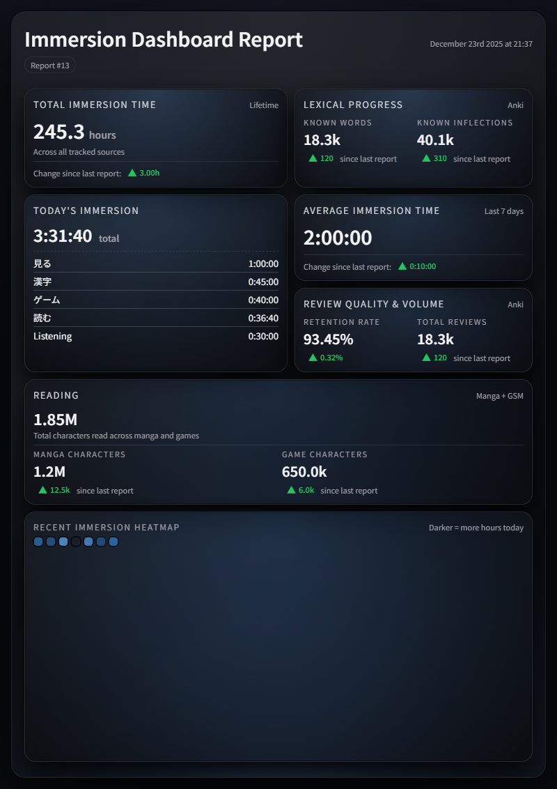
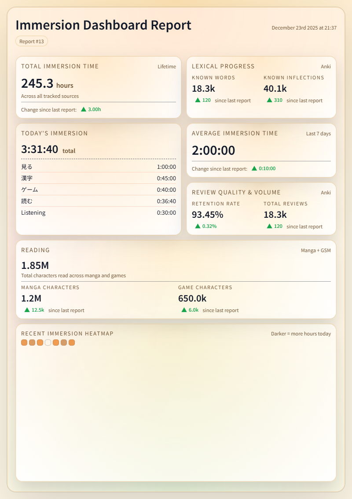

**Alpha release**

Tokei is currently in alpha. This README includes both quick-start instructions for regular users and advanced setup details for power users to ensure HTML **and PNG** reports work reliably.

Note: Tokei currently runs as a console app (CLI). A UI is planned.

# Tokei (dashboard sync)

  

Tokei is a standalone sync + report generator that combines:

- Toggl (API token) for lifetime + today immersion (with description breakdown)
- Anki stats (either built-in snapshot exporter or the Hashi add-on) for retention + review totals
- Mokuro (volume-data.json) for manga characters read
- Ttsu Reader (ttu-reader-data/statistics_*.json) for novel characters read
- GameSentenceMiner (gsm.db) for GSM characters read

It caches merged snapshots into cache/tokei_cache.sqlite, then renders:

- HTML: output/Tokei Report <report_no>.html
- PNG:  output/Tokei Report <report_no>.png
- Warnings: output/Tokei Report <report_no> WARNINGS.txt (only if warnings exist)

## Theme samples

  
  

## Recommended first-time setup

### Quick start (most users)

1) Install Node.js 18+
2) Run Tokei from the Start Menu shortcut
3) During first run, use the built-in Anki snapshot setup to select decks + fields for Anki retention/review stats

Optional (advanced): install the Hashi Anki add-on instead of using built-in snapshots:
- In Anki: `Tools > Add-ons > Get Add-ons...` and enter `1132527238`
- Link: https://ankiweb.net/shared/info/1132527238

Tokei will generate HTML reports by default. PNG reports require additional setup (see below).

### PNG output (required for PNG reports)

PNG reports are rendered using Puppeteer via Node.js.

To enable PNG output:

1) Install Node.js 18+
2) Open a terminal in the Tokei directory
   (for example: `C:\Program Files\Tokei\`)
3) Run:

    npm install puppeteer

Tokei expects Puppeteer to be available at:

    <Tokei directory>\node_modules\puppeteer

If Puppeteer is not installed, Tokei will still generate HTML reports, but PNG output will fail with a warning.

This explicit setup is intentional for the alpha release to maximize PNG reliability.

## Scripts (Windows)

- Setup-Environment.bat
  - Creates the local Python venv in .venv
  - Installs Python dependencies from requirements.txt
  - Installs Node dependencies (npm install)
  - Verifies Node.js 18+ and Puppeteer are available
  - Safe to run multiple times
- Setup-Tokei.bat
  - User configuration / onboarding only
  - Prompts for Toggl token, baseline, timezone, theme, output folder, Anki profile
  - Writes config.json and toggl-token.txt
  - Does not install software or change system state
  - Safe to run multiple times
- run.bat
  - Activates the local venv
  - Runs the application
  - Does not perform setup or installation
  - Safe to run multiple times
- Refresh-Today-Report.bat
  - Runs the app but overwrites today's existing report (no extra report number)
  - Safe to run multiple times (asks for confirmation)
- Tokei.bat
  - Legacy wrapper that calls run.bat
- Reset-Tokei.bat
  - Deletes cache/ and output/
  - Resets config.json back to defaults
  - Optional: deletes toggl-token.txt

## Config reference

- `config.json` is the live config used by Tokei.
- `config.example.json` is documentation only (not loaded at runtime).
- Field types are implied by the example values; keep the same types when editing `config.json`.
- Anki snapshot:
  - `anki_snapshot.enabled`: if true, Tokei uses the built-in Anki snapshot exporter instead of Hashi HTTP exports.
  - `anki_snapshot.rules`: list of deck/field rules (supports multiple decks and note types per rule); see `config.example.json`.
- Phase 2:
  - Optional CSV ingest: any `*.csv` in `data/` (first column only; one or more header rows allowed). If no CSVs exist in `data/`, it falls back to `data/csv/known.csv` and `known.csv` for compatibility.
  - Optional config: `phase2.csv_rule_id` (defaults to `default`).

Troubleshooting:

- Runtime logs + exit code notes: `INTERNAL.md`
- Recent changes: `CHANGELOG.md`

## External data sources (read-only)

Tokei reads from these external tools but does not modify them:

- Anki (two supported snapshot producers)
  - Built-in snapshot exporter (recommended): reads your Anki profile `collection.anki2` and writes Hashi-compatible exports under `hashi_exports/` (configurable)
  - Hashi (Anki add-on, optional): writes the same exports under `hashi_exports/` (configurable)
- GSM (Game Sentence Miner)
  - Reads gsm.db (auto path uses %APPDATA%\GameSentenceMiner\gsm.db)
  - If missing, Tokei warns and continues
- Mokuro
  - Reads volume-data.json from the configured path
  - If missing, Tokei warns and continues
- Ttsu Reader
  - Reads statistics_*.json under the configured ttu-reader-data directory
  - If missing, Tokei warns and continues

## Notes

- output_dir in config.json can be absolute or relative to the Tokei folder.
- Theme previews are available as PNGs in samples/.
- For fresh Anki stats:
  - If `anki_snapshot.enabled=true`, Tokei exports from `collection.anki2` before reading the file.
  - Otherwise, Tokei triggers a Hashi export via http://127.0.0.1:8766/export before reading the file.
- Toggl /me/time_entries may limit how far back it can query. Use toggl.baseline_hours to account for older time if needed.

## Build Tokei.exe (app-only)

Tokei.exe bundles Python + the Tokei code, but still requires external Node.js and Puppeteer.
It behaves like running Tokei.bat and does not install dependencies.

Build steps (one-folder):

1) Install PyInstaller into the local venv:
   - `.venv\Scripts\python.exe -m pip install pyinstaller`
2) Build:
   - `.venv\Scripts\python.exe -m PyInstaller --clean --noconfirm tokei.spec`
3) Output:
   - `dist\Tokei\Tokei.exe`

Run requirements for the built exe:

- Node.js 18+ is on PATH
- `node_modules\puppeteer` exists in the same folder as Tokei.exe (run Setup-Environment.bat there)
- `config.json` exists (run Setup-Tokei.bat there)

## Re-running guidance

- Setup-Environment.bat and Setup-Tokei.bat are typically one-time; rerun only when dependencies or settings change.
- Rerun Setup-Environment.bat if Python/Node dependencies change.
- Rerun Setup-Tokei.bat any time you want to update settings.
- run.bat is safe to run daily (it will detect same-day reports and offer: new report / overwrite today / cancel).
- Reset-Tokei.bat is destructive; use it only when you want to wipe cache/output.
